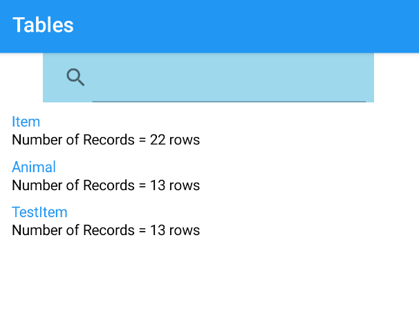

# SQLite-PCL-DatabaseViewer
**This is an SQLiteViewer for Xamarin**  
Should you want to try your own SQLite database in your phone instead of creating one, you can change the path in the SDatabase constructor by renaming dbPath in the App.xaml.cs file. 
Once your Database Path has been found a list of existing Tables should appear with their row counts. You can then click select on a given Table and all of its information should be displaed along with an editor and a submit button.  
 

 
By entering an sqlQuery into the editor and submiting it using the submit button you can manipulate your SQLite Database.  
Note that all the SQLite Queries supported are that of SQLite-net-PCL.  
Alert messages describing the number of rows affected will only be displayed if your query starts with UPDATE, INSERT and DELETE. For example: 
- UPDATE TableName SET FieldName WHERE CONDITION 
- DELETE FROM TableName SET FieldName = value WHERE CONDITION
- INSERT INTO TableName (Fields) VALUES (Field values)
Should there otherwise be an error in your Query, a display message displaying the error or exception will appear.
# Installation
**Packages**  
First and foremost, three Nuget packages are required for the program to work correctly  
- MvvmLightLibs Version="5.4.1.1" or newer
- sqlite-net-pcl Version="1.7.335" or newer 
- Syncfusion.Xamarin.SfDataGrid Version="18.2.0.46" or newer  
**Renaming the Namespaces**
Should you choose to install these pages in another project, you can download this project, rename the Namespaces to correspond with your App and add the necessary files.  
You can copy paste the directories or if these directories already exist you can just copy the files onto that directory. 
After installing these packages depending on the project follow the steps below  
**Adding to a New Project** 

