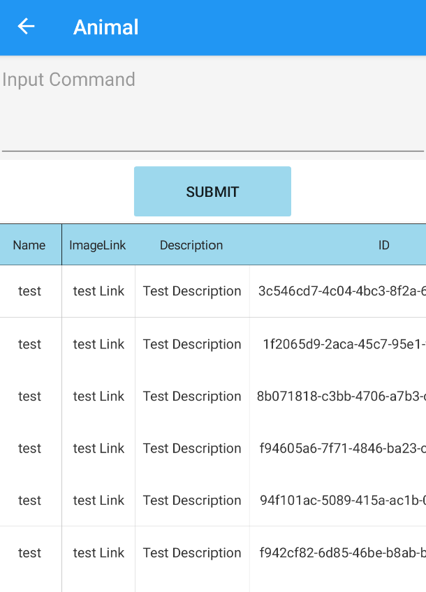
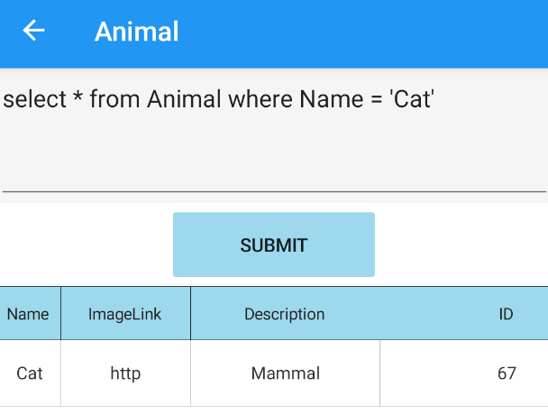
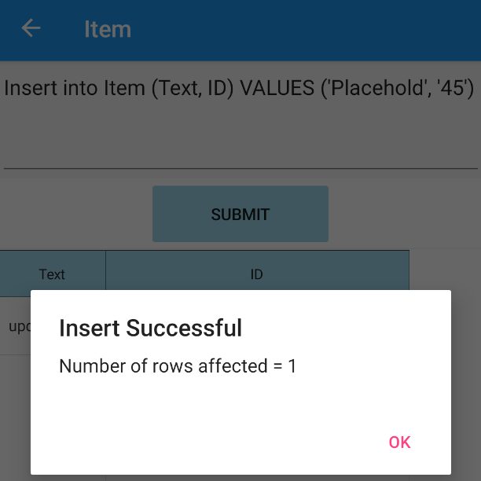
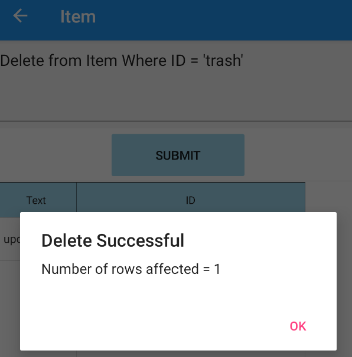
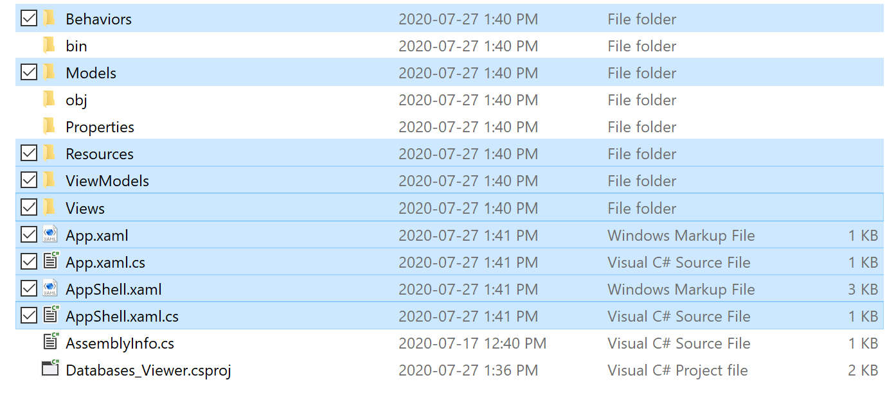
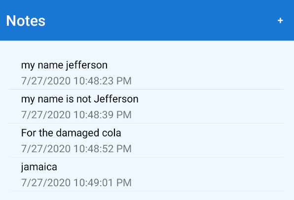
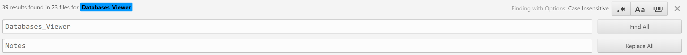
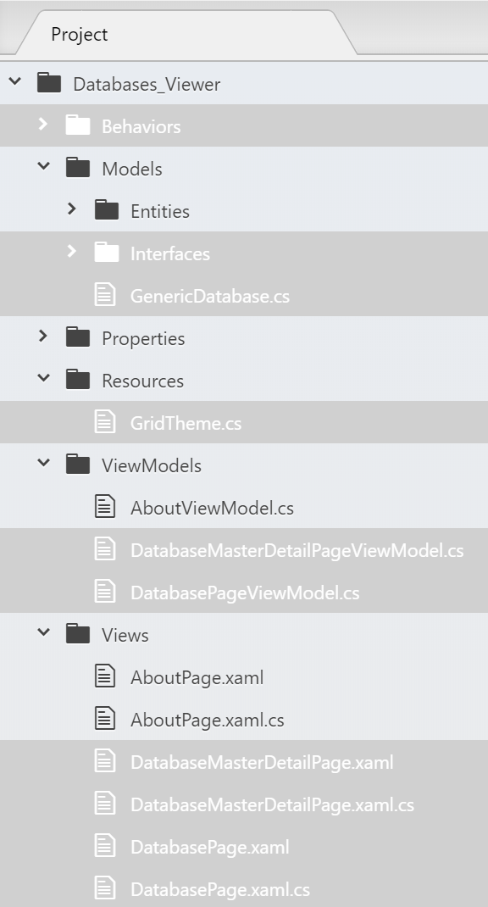
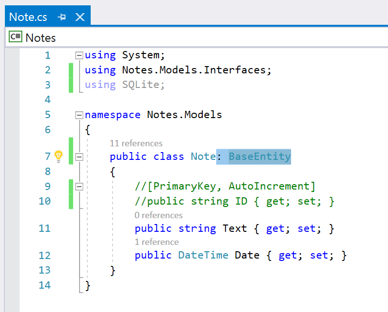
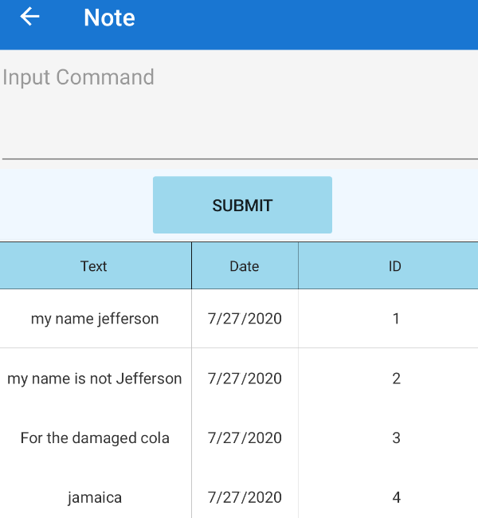

# SQLite-PCL-DatabaseViewer
**This is an SQLiteViewer for Xamarin**  
Should you want to try your own SQLite database in your phone instead of creating one, you can change the path in the SDatabase constructor by renaming dbPath in the App.xaml.cs file. 
Once your Database Path has been found a list of existing Tables should appear with their row counts. You can refresh the List by pulling to refresh and you can search amongst the existing Tables.  

 
 
You can then click select on a given Table and all of its information should be displaed along with an editor and a submit button.    

 
 
By entering an sqlQuery into the editor and submiting it using the submit button you can manipulate your SQLite Database.    

 
Note that all the SQLite Queries supported are that of SQLite-net-PCL.  
Alert messages describing the number of rows affected will only be displayed if your query starts with UPDATE, INSERT and DELETE. For example: 
- UPDATE TableName SET FieldName WHERE CONDITION  
- DELETE FROM TableName SET FieldName = value WHERE CONDITION  
- INSERT INTO TableName (Fields) VALUES (Field values)  
Should there otherwise be an error in your Query, a display message displaying the error or exception will appear.    

   

 

# Installation  
**Packages**  
First and foremost, three Nuget packages are required for the program to work correctly  
- MvvmLightLibs Version="5.4.1.1" or newer https://www.nuget.org/packages/MvvmLight
- sqlite-net-pcl Version="1.7.335" or newer https://www.nuget.org/packages/sqlite-net-pcl/
- Syncfusion.Xamarin.SfDataGrid Version="18.2.0.46" or newer  https://www.nuget.org/packages/Syncfusion.Xamarin.SfDataGrid/18.2.0.46?_src=template 

**Renaming the Namespaces**  
Should you choose to add the viewer to another project, you can download this project, rename the Namespaces to correspond with your App's name and add the necessary files.  
You can copy paste the directories or if these directories already exist you can just copy the files onto that directory.  
 
**Note that the Entities folder inside of Models should contain all the Table objects you want initialized. When The GenericDatabase Object is created, the contructor automatically creates a Table for each Object that extends the BaseEntity folder. Animal, Item and TestItem are just examples you can use to test the functionality of the application and can be omitted.**  
 
After installing these packages depending on the project follow the steps below  
**Adding to a New Project** 
You can directly copy paste the following files **after renaming the namespaces** and build

  

 
Finally, inside of your App.xaml.cs add the following code and replace the databasePath with the one of your choice  
        
        public static GenericDatabase database;
        
        public static GenericDatabase Database
        {
            get
            {
                if (database == null)
                {
                    database = new GenericDatabase(Path);
                }
                return database;
            }
        }
        
**Adding to an Old Project** 
Adding to an old project can be tricky depending on if the existing Database objects already implement the BaseEntity Interface. Should they not you can either modify the BaseEntity interface or the Database Object itself. (in this example I chose to change the BaseEntity file)  
Let us try to add the project to the notes Database here: https://docs.microsoft.com/en-us/samples/xamarin/xamarin-forms-samples/getstarted-notes-styled/.  
Here are some random values I added  

  

1. Download and install the nuget Packages on the Notes Solution.  
2. Rename the namespaces

  

3. These essential folders need to be added

  

4. Extend the Note object to BaseEntity

  

5. Add the following code to the App.xaml.cs and all should work 
 public static GenericDatabase database;
        
        
        public static GenericDatabase database;
        
        public static GenericDatabase Database
        {
            get
            {
                if (database == null)
                {
                    database = new GenericDatabase(Path);
                }
                return database;
            }
        }
 6. The table should then appear in the list of tables. Upon clicking you should get something like this:
 

  

 
